# deploymentgraphics

Render Warhammer 40k mission deployment maps as SVG, driven entirely by
typed config. Ships the renderer plus ready-to-use presets for the six
standard missions and a built-in terrain set.



## Install

```sh
npm install deploymentgraphics
```

This package is **ESM-only** — import it with `import`. It cannot be loaded
with `require()` from a CommonJS module.

## Usage

`makeMissionCard(config)` returns an `<svg>` element. The quickest path is
to combine a mission preset with `buildConfig`:

```ts
import { makeMissionCard } from "deploymentgraphics";
import { buildConfig, missions } from "deploymentgraphics/presets";

const svg = makeMissionCard(buildConfig({ mission: missions.dawn_of_war }));
document.body.appendChild(svg);
```

Add terrain, or toggle the grid and territory line, via `buildConfig`
overrides:

```ts
const svg = makeMissionCard(
  buildConfig({
    mission: missions.search_and_destroy,
    layout: "1", // draw terrain layout 1
    grid: true,
    territory: false,
  }),
);
```

Everything is also exported from the package root, so a single import
works too:

```ts
import { makeMissionCard, buildConfig, missions } from "deploymentgraphics";
```

### Server-side rendering

`makeMissionCard` creates SVG nodes with `document.createElementNS`, so it
needs a DOM. In Node, use `renderMissionCardToString` instead — it renders
the same card to markup with no DOM and no dependencies:

```ts
import { renderMissionCardToString, buildConfig, missions } from "deploymentgraphics";

const svg = renderMissionCardToString(
  buildConfig({ mission: missions.tipping_point }),
);
console.log(svg);
```

The markup carries an `xmlns`, so it works inline in an HTML response as
well as on its own in a `.svg` file.

The card is sized by its `viewBox` alone, which leaves a standalone file or
an `` to pick a size. Pass `width`/`height` to fix one — the board is
measured in inches, so this renders a 60×44 board at 15px per inch:

```ts
import { baseTheme } from "deploymentgraphics";

const svg = renderMissionCardToString(
  buildConfig({ mission: missions.tipping_point }),
  baseTheme,
  { width: 60 * 15, height: 44 * 15 },
);
```

## Presets

`deploymentgraphics/presets` exports plain, typed config objects — no
YAML parsing or file IO at runtime:

- `missions` — the six standard missions, keyed by id (`dawn_of_war`,
  `crucible_of_battle`, `hammer_and_anvil`, `search_and_destroy`,
  `sweeping_engagement`, `tipping_point`). Each is also exported by name
  (`dawnOfWar`, …).
- `gwTerrain` — building templates and two numbered layouts.
- `baseConfig` — default board size (60×44 inches) and styling.
- `buildConfig(options)` — merges a mission, terrain, and base into the
  `FullConfig` that `makeMissionCard` consumes.

Build a config by hand instead of using `buildConfig` for full control —
see the `FullConfig` type, which is exported from the package root.

## License

MIT
